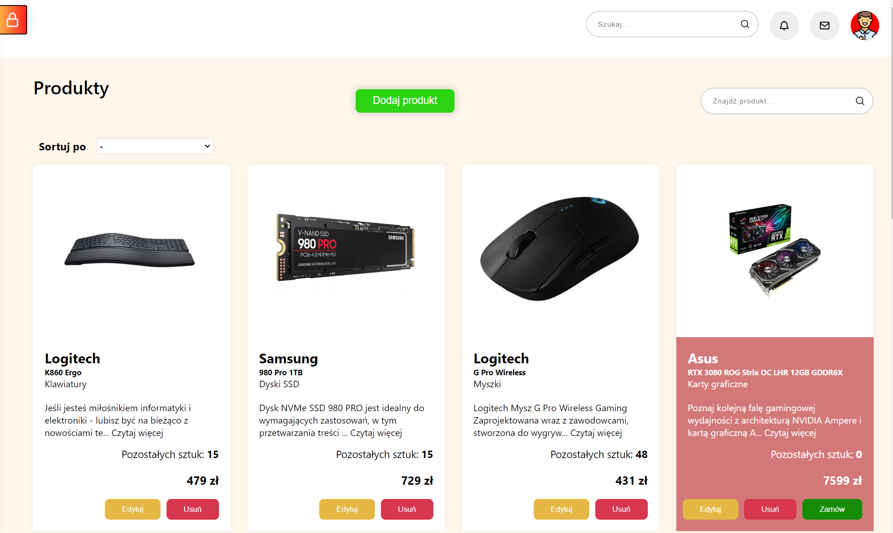
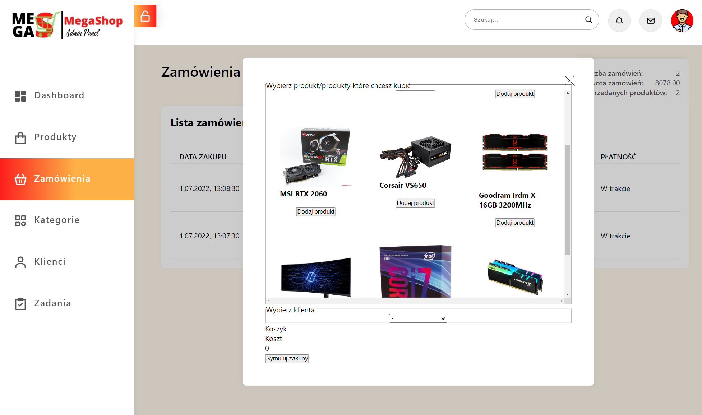

# Projekt zaliczeniowy do kursu MegaK

`React.js` `Express.js` `MySQL` `HTML` `CSS` `TypeScript`

## Panel administracyjny hipotetycznego sklepu internetowego

1. [Wstęp](#Wstęp)
2. [Plany rozwoju aplikacji](#plany-rozwoju-aplikacji)
3. [Uruchomienie programu](#uruchomienie-programu)
4. [Wykorzystane technologie](#wykorzystane-technologie--paczki--jezyki-programowania)
5. [Opis działania programu](#opis-dzialania-programu)
    - [Dashboard](#Dashboard)
    - [Produkty](#Produkty)
    - [Zamówienia](#Zamówienia)
    - [Kategorie](#Kategorie)
    - [Klienci](#Klienci)

# Wstęp

### Mój pierwszy większy projekt full stack. Projekt ma symulować panel administracyjny sklepu internetowego. Można dodawać nowe produkty do bazy, można symulować zamówienia, dodawać klientów i tworzyć kategorie. Projekt jest w podstawowej wersji działania i bedzie rozwijany o kolejne funkcje.

# Plany rozwoju aplikacji

1. Po wykonaniu czynności u góry po prawej stronie przy dzwoneczku będzie wyświetlało się powiadomienie z wiadomością jaka czynność została wykonana
2. Podpięcie prostego sklepu internetowego z możliwością zalogowania się klienta oraz admina, który będzie mógł wejść na panel administracyjny
3. Możliwość wysłania wiadomości do sklepu i ta wiadomość zostanie przesłana do panelu admina z powiadomieniem przy kopercie
4. Wprowadzanie poprawek i usprawnień
5. Stworzenie Todo listy na stronie zadania gdzie admin będzie mógł stworzyć sobie listę zadań na następny dzień

# Uruchomienie programu

Najpierw ściągnij pliki lub sklonuj zdalne repozytorium na swój lokalny
dysk. [Tutaj](https://github.com/hugobosy/endProject-megaK-back) jest repozytorium do back-end, który też musisz pobrać.

## Ważne !

_Folder, w którym znajdują się pliki z back-endu musi mieć nazwę `back-end` !_

Po ściągnięciu plików wpisz w terminalu to polecenie:
> `npm install`

Wykonaj to polecenie osobno w folderze z front-end'em i osobno z back-end'em

W folderze z back-endem jest folder `dataDB` a w nim plik z cała bazą sql. Aby program działał poprawnie musisz
zaimportować plik do swojej bazy lokalnej

W pliku `db.ts` jest konfiguracja połaczenia się z bazą danych:

```
import {createPool} from "mysql2/promise";

export const pool = createPool({
    host: 'localhost',
    user: 'root',
    database: 'mega_shop',
    namedPlaceholders: true,
    decimalNumbers: true,
})
```

Jeżeli masz inne dane, musisz je edytować w ten sposób, aby odpowiadały Twojej bazie!

Teraz w konsoli wystarczy uruchomić back-end oraz front-end

> W terminalu wchodzimy do folderu z back-endem a potem z front-endem i wpisujemy polecenie dla kazdego z nich:
> > npm start

Zrobione! :smiley:

# Wykorzystane technologie / paczki / jezyki programowania

| Technologia, paczka, język programowania |           Opis            |  Wersja                |
|:---                                      |:-------------------------:|-----------------------:|
|HTML                                     |     Struktura strony      | 5|
|CSS| Stylizacja wyglądu strony |3|
|JavaScript|    język programowania    |ES6+|
|TypeScript|       Nadbudówka JS       |4.7.3|
|React|       Framework JS        |18|
|react-router-dom| Routing|6.3|
|UUID|Generator unikalnych ID|8.3.2|
|@styled-icons/boxicons-(typ)| Ikony |10.38|

# Opis dzialania programu

## Dashboard


> 1. Z lewej strony mamy menu, które możemy zamykać i otwierać klikając na kłódkę u góry.
> 2. __Logo tworzone na podstawie loga kursu. Wszelkie prawa zastrzeżone__
> 3. W dashboardzie mamy podsumowanie zamówień, ilość klientów, jakie produkty się najlepiej sprzedają, oraz listę zamówień

## Produkty



> 1. W zakładce produkty widzimy listę produktów jakie są w bazie
> 2. Zdjęcia produktów są wstawiane do bazy w formie odnośników do obrazków
> 3. Gdy brakuje towaru na naszym "magazynie" wtedy opis jest na czerwonym tle i wyświetla się dodatkowy przycisk do zamówienia tego towaru
> 4. Są tez przyciski do edycji oraz usuwania produktu
> 5. Mozna sortować produkty po wybranych opcjach oraz wyszukać produkt

#### Dodawanie produktu


> 1. Po kliknięciu w przycisk Dodaj produkt wyskoczy nam takie okienko
> 2. Musimy wypełnić kazde pole inaczej wyświetli się nam stosowna informacja (w czasie tworzenia readme walidacja formularza jeszcze nie jest wprowadzona!)
> 3. Po dodaniu produktu wyświetli się informacja ze produkt został dodany do bazy oraz po zniknięciu informacji strona zostanie przeładowana.


#### Edycja produktu


> 1. Po kliknięciu Edytuj pojawi się okienko takie same jak dodawanie produktu, z tym że pewne informacje takie jak opis czy link do zdjęcia pozostaną wyświetlone w placeholder. W przyszłości zostanie to zmienione na zwykły tekst do edycji, bo w tej wersji musimy na nowo wprowadzać wszystkie dane.

## Zamówienia


> 1. Strona zamówienia posiada listę wszystkich zamówień
> 2. Po prawej stronie mamy podsumowanie liczby zamówień, łączną kwotę oraz ile sprzedaliśmy produktów
> 3. NA środku jest przycisk gdzie mozemy zasymulować zakupy



> 1. Po kliknięciu Symuluj zamówienie wyskoczy okienko z listą produktów z wyborem klienta i zatwierdzenia symulacji
> 2. Przy wyborze produktu na dole będzie wyświetlana lista
> 3. Musimy wybrać klilenta by móc wykonać symulację
> 4. Gdy któregoś produktu nie ma "na stanie" wtedy nie będzie wyświetlany na liście produktów w symulacji

## Kategorie


> 1. Strona posiada zbiór kategorii produktów w sklepie
> 2. Kategorie mozna dodawać w formularzu po prawej stronie
> 3. Kategorie mozna usuwać klikając ikonkę kosza (aktualnie po kliknieciu automatycznie jest usuwana kategoria, w przyszłości będzie po kliknięciu potwierdzenie czy na pewno chcemy usunąc)

## Klienci


> 1. Strona wyświetla wszystkich "zarejestrowanych" klientów sklepu
> 2. Klienta mozna usunąć klikając na ikonę śmietnika(nie dodano jeszcze potwierdzenia)
> 3. Klienta mozna zbanować klikając w czerwoną dłoń

### Dodawanie klienta


> 1. Po kliknięciu w przycisk dodaj klienta wyskoczy okienko z formularzem
> 2. Wszystkie dane muszą być wprowadzone
> 3. Formularz posiada podstawową walidację
